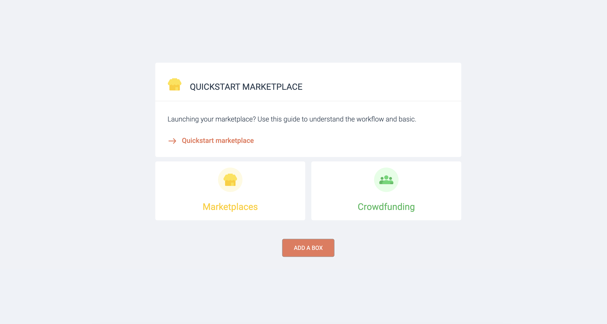

# MP technical test

This project is separated in 2 folders : 
- vanillajs
- vuejs

Both have the assets folder with the CSS file and svg files, and can be launched independently.

## Result overview
 

## Launch & Test

> Clone this respository

### VueJS
VueJs 2 has been used

- Technical requirements  
NodeJS   
[*Installer NodeJS*](https://nodejs.org/en/ "Installer NodeJS")

- Go to root directory vuejs and run `$npx serve`

### VanillaJS
- Technical requirements   
Open with Live Server on VsCode

>Almost same code can be found on 
[*Codepen*](https://nodejs.org/en/ "Codepen") : https://codepen.io/oceanek/pen/ZExbypW 

## More info
Colors and buttons/links effects has been choosen according to the official home page

Thank you for reading!
